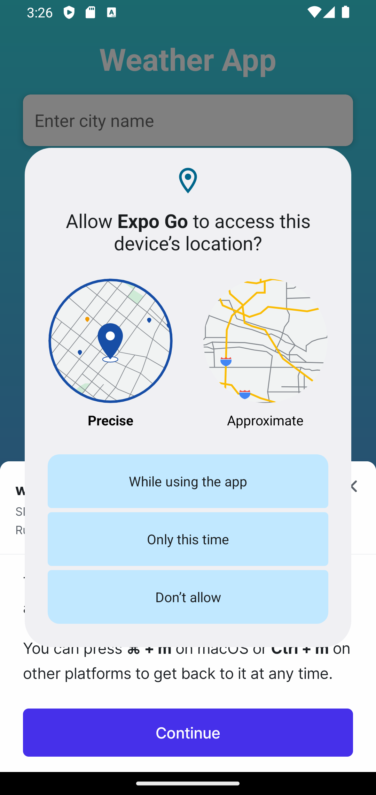
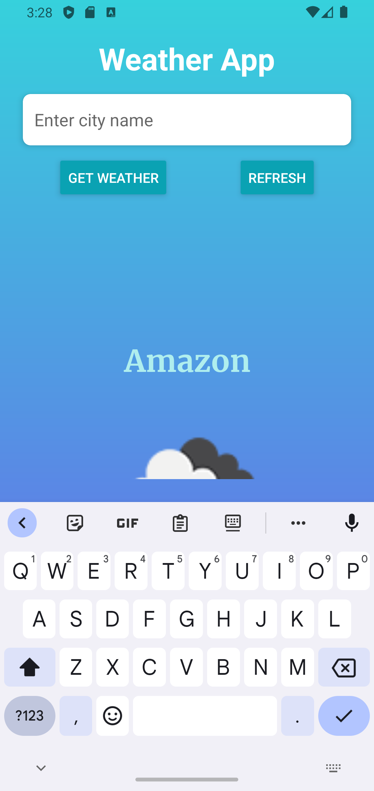
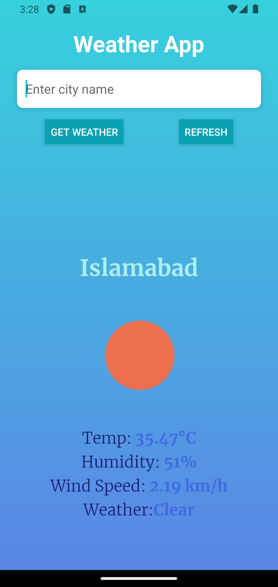
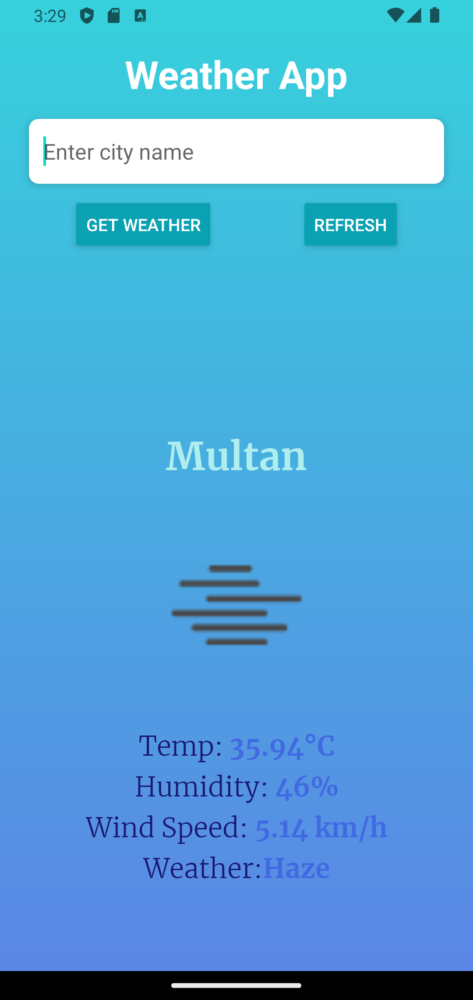

## Usage

- Launch the app.
- Grant location permission to get weather data based on your current location or enter a city name to search for weather information.
- Press the "Get Weather" button to retrieve weather data.
- Swipe down to refresh weather data.

## Screenshots

## Technologies Used

- React Native
- Expo
- Linear Gradient
- Expo Location
- OpenWeatherMap API
